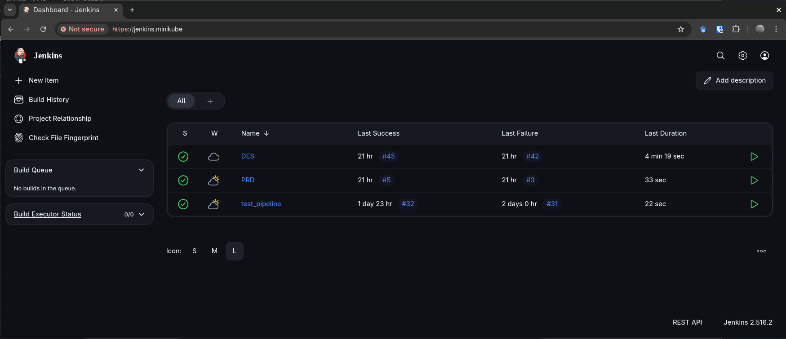

# Hackthon Devops

<!--toc:start-->
- [Hackthon Devops](#hackthon-devops)
  - [Passo a passo da implantação do cluster](#passo-a-passo-da-implantação-do-cluster)
    - [1 Minikube](#1-minikube)
    - [2 Jenkins](#2-jenkins)
      - [Copiar dados de configuração do Jenkins para VM](#copiar-dados-de-configuração-do-jenkins-para-vm)
      - [Criar Deployment, service e ingress](#criar-deployment-service-e-ingress)
  - [Configure o DNS](#configure-o-dns)
  - [Instalação e Configuração da aplicação web](#instalação-e-configuração-da-aplicação-web)
    - [Passo 1 um _namespace_ para o quickstart:](#passo-1-um-namespace-para-o-quickstart)
    - [Passo 2 criar deployments para quickstart:](#passo-2-criar-deployments-para-quickstart)
    - [Passo 3 criar services para quickstart:](#passo-3-criar-services-para-quickstart)
    - [Passo 4 criar o ingress para quickstart:](#passo-4-criar-o-ingress-para-quickstart)
    - [pipelines](#pipelines)
  - [Estratégia de versionamento.](#estratégia-de-versionamento)
  - [Os códigos de automação desenvolvidos, scripts e Docker file.](#os-códigos-de-automação-desenvolvidos-scripts-e-docker-file)
<!--toc:end-->



## Passo a passo da implantação do cluster

O passo a passo a seguir foi feito utilizando: **linux** com **VirtualBox** e **kubectl** instalado

### 1 Minikube

O minikube é a ferramenta **official** do kubernetes para provisionamento local de cluster.
Para instalar acesse o link: https://minikube.sigs.k8s.io/docs/start/?arch=%2Flinux%2Fx86-64%2Fstable%2Fbinary+download.
Uma vez instalado podemos provisionar um cluster com o comando:

```bash
minikube start
```

### 2 Jenkins

O escolhido instalar o Jenkins no próprio cluster para execute todos os comandos abaixo:

```bash
kubectl create namespace devops-tools
```

**OBS: para os comandos abaixo funcionarem esteja no diretório desse repositório**

```bash
kubectl create -f  ./kube_yamls/jenkins/jenkins-01-serviceAccount.yaml
kubectl create -f ./kube_yamls/jenkins/jenkins-02-volume.yaml
```

#### Copiar dados de configuração do Jenkins para VM

Uma vez instalado o volume será necessário uma intervenção manual para copiar os dados de [/data/jenkins](./data/jenkins) para `\data\jenkins` na VM criada pelo minikube.
Crie um ponto de montagem e passe os arquivos para dentro da VM:

```bash
mkdir minikube
minikube mount minikube:/data/share
cp -r data/jenkins minikube
```

Acesse via ssh a VM e mude o local dos arquivo :

```bash
minikube ssh
cd /data/
sudo rm -r jenkins
sudo mv share/jenkins/ ./
```

#### Criar Deployment, service e ingress

```bash
kubectl create -f ./kube_yamls/jenkins/jenkins-03-deployment.yaml
kubectl create -f ./kube_yamls/jenkins/jenkins-04-service.yaml
kubectl create -f ./kube_yamls/jenkins/ingress.yaml
```

Para dar permissão ao pod criado Jenkins capacidade de editar deployments do quickstart adicione 

```bash
kubectl create -f ./kube_yamls/jenkins/deployment-role.yaml
```

## Configure o DNS

Nesse projeto se faz necessário adicionar ao sistema operacional o cluster `minikube` para resolver o domínio `.minikube`.
Para isso siga a documentação official do minikube: https://minikube.sigs.k8s.io/docs/handbook/addons/ingress-dns/#Linux.
No meu caso, uso Linux com NetworkManager. Os meus arquivos de configuração ficaram:

```bash
# instalando os addons
minikube addons enable ingress
minikube addons enable ingress-dns
```

```bash
#/etc/NetworkManager/NetworkManager.conf
# Configuration file for NetworkManager.
# See "man 5 NetworkManager.conf" for details.
[main]
dns=dnsmasq
```

```bash
#/etc/NetworkManager/dnsmasq.d/minikube.conf
# Configuration file for NetworkManager.
# See "man 5 NetworkManager.conf" for details.
server=/minikube/192.168.59.100
```

Uma vez configurado e os pods devidamente inicializados você deve ser capaz de acessar o Jenkins pela url: https://jenkins.minikube/

## Instalação e Configuração da aplicação web

### Passo 1 um _namespace_ para o quickstart:

Para criar um _namespace_ para o quickstart, basta executar o comando

```bash
kubectl create namespace quickstart
```

### Passo 2 criar deployments para quickstart:

```bash
kubectl create -f ./kube_yamls/quickstart/quickstart-des-deployment.yaml
kubectl create -f ./kube_yamls/quickstart/quickstart-prd-deployment.yaml
```

### Passo 3 criar services para quickstart:

```bash
kubectl create -f ./kube_yamls/quickstart/quickstart-des-service.yaml
kubectl create -f ./kube_yamls/quickstart/quickstart-prd-service.yaml
```

### Passo 4 criar o ingress para quickstart:

```bash
kubectl create -f ./kube_yamls/quickstart/ingress.yaml
```

Uma vez que pods estejam devidamente inicializados a aplicação pode ser vista nos endereços:

- PRD: https://quickstart.minikube/hello
- DES: https://quickstart.dev.minikube/hello

### pipelines

A pipeline para testes e validações possui o nome no Jenkins de DES e pode ser vista no [Jenkinsfile_DES](./Jenkinsfile_DES) ela é o grosso desse projeto,
uma vez que promover um código para produção é mudar a versão do container do `deployments/quickstart-prd` para a versão desejada.

- Pipeline DES: [Jenkinsfile_DES](./Jenkinsfile_DES)
- Pipeline PRD: [Jenkinsfile_PRD](./Jenkinsfile_PRD)

## Estratégia de versionamento.

O versionamento da aplicação é controlando pela variável de ambiente `TAG` que por sua vez está sendo versionando
pelo git em um repositório no Github. O valor contido no repositório é a fonte da verdade de modo que para rodar
uma pipeline com a nova versão, devesse atualizar o repositório git e então executar a pipeline.
A variável `TAG` controla a versão do container docker da aplicação. Na pipeline [Jenkinsfile_DES](./Jenkinsfile_DES)
`TAG`é utilizada para a compilação do novo container que por sua vez é disponibilizado no meu [repositório quickstart do Docker Hub](https://hub.docker.com/repository/docker/samuelcavalcanti/quickstart/general).

## Os códigos de automação desenvolvidos, scripts e Docker file.

Todos os códigos desenvolvidos foram salvos nesse repositório no Github: https://github.com/samuel-cavalcanti/quarkus-quickstart 
